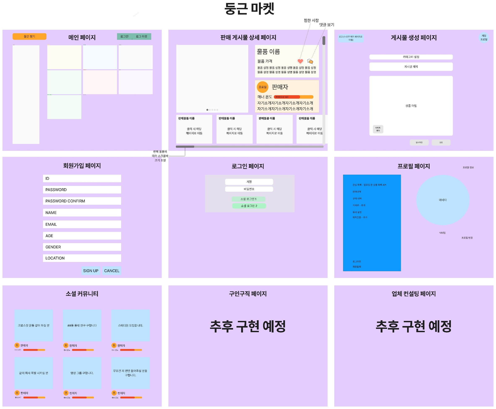

# 🖥️ Team Ace의 Node.js 뉴스피드 프로젝트

## 프로젝트 소개
- 프로젝트 이름 : 둥근 마켓
- 내용 : 현재 서비스 중인 “당근 마켓” 사이트를 오마주 하여 뉴스피드 프로젝트
- 구분 : 팀 프로젝트
- GitHub : https://github.com/KwangSoo1555/sparta-4nd-week-newsfeed
- 시연 영상 : 
- 배포 : https://currypang.shop/

 

## 팀원 구성
- 팀장 : 복광수 [@KwangSoo1555](https://github.com/KwangSoo1555)
- 팀원 : 김정찬 [@jkc-mycode](https://github.com/jkc-mycode)
- 팀원 : 채유일 [@currypang](https://github.com/currypang)
- 팀원 : 구남욱 [@9r3dflam3](https://github.com/9r3dflam3)
- 팀원 : 주진아 [@ovew](https://github.com/letsovew)

 

## 1. 개발 기간
- 2024.05.31 ~ 2024.06.06

 

## 2. 개발 환경
- 운영체제 : Window/Mac
- FrontEnd : X
- BackEnd : Node.js, Express, MySQL(Prisma)
- Tool : Visual Studio Code, Insomnia, MySQL Workbench, DBeaver
- Publish : PM2, AWS/RDS, AWS/EC2, AWS/load balancer

 

## 3. 역할 분배
- **복광수**
  - 회원가입 기능
  - nodemailer를 이용한 이메일 인증
  - 내 정보 조회, 수정
  - 게시글 판매 완료
  - 상품 구매/판매 내역 생성, 조회
  - passport를 이용한 네이버 소셜 로그인
- **김정찬**
  - 각 API 유효성 검사 스키마 구현
  - 상수, 출력 메세지 객체 모듈화
  - 게시물 조회, 수정, 삭제
  - 게시물 좋아요/좋아요 취소
  - multer를 이용한 이미지 업로더
- **채유일**
  - 로그인/로그아웃
  - Access Token, Refresh Token 미들웨어
  - passport를 이용한 카카오 소셜 로그인
  - AWS S3 구성 및 설정
  - ERD 작성 및 테이블 스키마 설계
- **구남욱**
  - 게시물 댓글 CRUD
  - 게시물 댓글 좋아요/좋아요 취소
- **주진아**
  - 게시물 생성
  - 사용자 간 팔로우

 

## 4. API 명세서 및 ERD, 와이어 프레임
 - API 명세서 : https://west-territory-778.notion.site/Team-Ace-Node-js-API-221adeefaec14c38bf1a623f068c0c22?pvs=4
 - ERD : https://drawsql.app/teams/currypangs-team/diagrams/team1

 

## 4. 주요 기능 및 설명
### 4-1. 이메일 인증 API
- 회원 가입을 위한 이메일 인증 코드를 반환하는 API입니다.

- 이메일 가입 시 이메일 인증을 위한 Nodemailer와 같은 패키지를 사용했습니다.

- nodemailer.createTransport() 메서드를 통해 메일 발송을 위한 객체를 생성합니다.

- codeObject라는 인증 코드 객체를 통해서 코드의 유효 여부를 판단합니다.

- https://github.com/KwangSoo1555/sparta-4nd-week-newsfeed/blob/d18ff6d70a04d30a36232b60cc7e42e8d2f3ea64/src/routers/auth-email.router.js#L29

 

### 4-2. 회원가입 API
- **이메일, 비밀번호, 비밀번호 확인, 별명, 거래 지역, 나이, 성별, 이메일 인증 코드**를 Request Body(**`req.body`**)로 전달 받습니다.

- **보안을 위해 비밀번호는** 평문(Plain Text)으로 저장하지 않고 `Hash` 된 값을 저장합니다.

- https://github.com/KwangSoo1555/sparta-4nd-week-newsfeed/blob/d18ff6d70a04d30a36232b60cc7e42e8d2f3ea64/src/routers/user.router.js#L14

 

### 4-3. 로그인 API
- **이메일, 비밀번호**를 Request Body(**`req.body`**)로 전달 받습니다.

-  **AccessToken(Payload**에 `사용자 ID`를 포함하고, **유효기한**이 `12시간`)을 생성합니다.

-  **RefreshToken(Payload**에 `사용자 ID`를 포함하고, **유효기한**이 `7일`)을 생성합니다.

-  **AccessToken**와**RefreshToken**을 반환합니다.

- https://github.com/KwangSoo1555/sparta-4nd-week-newsfeed/blob/d18ff6d70a04d30a36232b60cc7e42e8d2f3ea64/src/routers/auth.routers.js#L14

 

### 4-4. 카카오 소셜 로그인 API
- `OAuth`를 이용한 로그인 API입니다.

- 외부의 로그인 인증 수단을 사용하기 위해 `passport` 모듈을 사용했습니다.

- 사용하기 위해서는 https://developers.kakao.com/ 에서 애플리케이션을 등록해야 합니다.

- 로그인 과정
  - `/auth/kakao` 라우터를 통해 로그인 요청이 들어오면 `passport.authenticate` 메서드 호출합니다.
  - `KakaoStrategy 전략` 실행해서 데이터베이스에 사용자 정보를 등록합니다
  - `사용자 ID`를 담은 `JWT 토큰`을 생성해서 클라이언트에게 반환합니다.

- https://github.com/KwangSoo1555/sparta-4nd-week-newsfeed/blob/d18ff6d70a04d30a36232b60cc7e42e8d2f3ea64/src/routers/auth-passport.router.js#L15

 

### 4-5. 네이버 소셜 로그인 API
- `OAuth`를 이용한 로그인 API입니다.

- 외부의 로그인 인증 수단을 사용하기 위해 `passport` 모듈을 사용했습니다.

- 사용하기 위해서는 https://developers.naver.com/ 에서 애플리케이션을 등록해야 합니다.

- 로그인 과정
  - `/auth/naver` 라우터를 통해 로그인 요청이 들어오면 `passport.authenticate` 메서드 호출합니다.
  - `naverStrategy 전략` 실행해서 데이터베이스에 사용자 정보를 등록합니다
  - `사용자 ID`를 담은 `JWT 토큰`을 생성해서 클라이언트에게 반환합니다.

- https://github.com/KwangSoo1555/sparta-4nd-week-newsfeed/blob/d18ff6d70a04d30a36232b60cc7e42e8d2f3ea64/src/routers/auth-passport.router.js#L36

 

### 4-6. 내 정보 조회 API
- 로그인한 사용자의 정보를 조회하는 API입니다.

- accessTokenValidator를 통해서 로그인한 사용자의 Access Token를 검증합니다.

- 토큰 유효성 검사가 통과하면 `req.user`를 통해 사용자의 정보를 가져옵니다.

- 그대로 조회한 사용자 데이터를 반환합니다.

- https://github.com/KwangSoo1555/sparta-4nd-week-newsfeed/blob/d18ff6d70a04d30a36232b60cc7e42e8d2f3ea64/src/routers/user.router.js#L80

 

### 4-7. 내 정보 수정 API
- 사용자의 정보를 수정하는 API입니다.

- `이메일, 별명, 수정할 비밀번호, 현재 비밀번호, 지역, 나이, 성별, 한 줄 소개`를 `req.body`를 통해 받아옵니다.

- 사용자 프로필은 `multer`를 이용해 `AWS S3`에 저장합니다.

- `newPassword(수정할 비밀번호)`가 입력되어 들어올 때만 비밀번호를 수정합니다.

- https://github.com/KwangSoo1555/sparta-4nd-week-newsfeed/blob/d18ff6d70a04d30a36232b60cc7e42e8d2f3ea64/src/routers/user.router.js#L92

 

### 4-8. 게시물 생성 API
- 판매할 상품의 정보를 입력 받아 게시물을 생성하는 API입니다.

- `게시물 제목, 게시물 내용, 상품 가격, 판매 지역`을 `req.body`를 통해 받아옵니다.

- `상품 사진`들은 파일을 업로드해서 보내면 `multer 객체`를 통해 `AWS S3에 URL 형태`로 저장됩니다.

- `상품 사진의 URL`은 `req.files`를 통해서 가져옵니다.

- 상품 사진은 필수로 첨부해야 합니다.

- https://github.com/KwangSoo1555/sparta-4nd-week-newsfeed/blob/d18ff6d70a04d30a36232b60cc7e42e8d2f3ea64/src/routers/trade.router.js#L15

 

### 4-9. 게시물 목록 조회 API
- 판매 등록된 상품의 정보 목록을 조회하는 API입니다.

- 일종의 `뉴스피드`, 모든 사용자들이 올리는 게시물을 보는 기능입니다.

- 기본적으로는 `시간 순`으로 정렬되며, `like 쿼리`를 통해 `좋아요 순`으로 정렬이 가능합니다.

- 상품들의 데이터 조회 시 관계가 설정된 `tradePicture 테이블`에서 `이미지 URL`를 반복해서 가져옵니다.

- https://github.com/KwangSoo1555/sparta-4nd-week-newsfeed/blob/d18ff6d70a04d30a36232b60cc7e42e8d2f3ea64/src/routers/trade.router.js#L66

 

### 4-10. 게시물 상세 조회 API
- 게시물의 상세한 정보를 조회하는 API입니다.

- 목록 조회와는 다르게 게시물의 `내용`도 포함하여 출력합니다.

- `상품 게시물의 ID`는 `req.params`를 통해 URL에서 가져옵니다.

- 상품들의 데이터 조회 시 관계가 설정된 `tradePicture 테이블`에서 `이미지 URL`를 반복해서 가져옵니다.

- https://github.com/KwangSoo1555/sparta-4nd-week-newsfeed/blob/d18ff6d70a04d30a36232b60cc7e42e8d2f3ea64/src/routers/trade.router.js#L115

 

### 4-11. 게시물 수정 API
- 상품 게시물의 정보를 수정하는 API입니다.

- 상품 게시물 작성과 마찬가지로 `게시물 제목, 게시물 내용, 상품 가격, 판매 지역`을 `req.body`를 통해 받아옵니다.

- 위 내용은 필수로 받아오는 게 아니라 `일부만 수정이 가능`합니다.

- `트랜젝션`을 사용해서 `게시물 데이터의 수정과 상품 사진 URL의 삭제, 새로 생성`을 진행합니다.

- 이미지 개수가 다를 수도 있고 어떤 이미지가 어떤 이미지로 수정되는지 알 방법이 없기 때문입니다.

- https://github.com/KwangSoo1555/sparta-4nd-week-newsfeed/blob/d18ff6d70a04d30a36232b60cc7e42e8d2f3ea64/src/routers/trade.router.js#L150

 

### 4-12. 게시물 삭제 API
- 상품 게시물을 선택해서 삭제하는 API입니다.

- `상품 게시물의 ID`는 `req.params`를 통해 URL에서 가져옵니다.

- 해당 ID를 조회하고 삭제를 진행합니다. `(Hard Delete)`

- https://github.com/KwangSoo1555/sparta-4nd-week-newsfeed/blob/d18ff6d70a04d30a36232b60cc7e42e8d2f3ea64/src/routers/trade.router.js#L150

 

### 4-13. 게시물 좋아요 API
- 상품 게시물에 좋아요를 할 수 있는 API입니다.

- `상품 게시물의 ID`는 `req.params`를 통해 URL에서 가져옵니다.

- 사용자 본인의 게시글에 좋아요를 누르거나, 이미 좋아요를 누른 경우 에러를 반환합니다.

- `N:M 관계`를 `암시적 테이블`로 연결하기 위해 `connect 절`을 사용해서 테이블을 연결했습니다.

- `좋아요 취소 API`는 로직이 거의 동일하기에 작성하지 않았습니다.

- https://github.com/KwangSoo1555/sparta-4nd-week-newsfeed/blob/d18ff6d70a04d30a36232b60cc7e42e8d2f3ea64/src/routers/trade.router.js#L252

 

### 4-14. 댓글 생성 API
- 해당 상품 게시물에 댓글을 작성하는 API입니다.

- `accessTokenValidator 미들웨어`를 통해 생성된 `req.user`에서 로그인한 사용자의 ID를 가져옵니다.

- `상품 게시물의 ID`는 `req.params`를 통해 URL에서 가져옵니다.

- `댓글 내용`을 `req.body`를 통해 가져옵니다.

- https://github.com/KwangSoo1555/sparta-4nd-week-newsfeed/blob/d18ff6d70a04d30a36232b60cc7e42e8d2f3ea64/src/routers/comment.router.js#L11

 

### 4-15. 댓글 조회 API
- 사용자들이 게시물에 작성한 댓글들을 조회하는 API입니다.

- 본인 뿐만 아니라 `모든 사용자의 댓글`이 보입니다.

- `상품 게시물의 ID`는 `req.params`를 통해 URL에서 가져옵니다.

- 기본적으로 `오래된 댓글일 수록 위에` 보입니다.

- https://github.com/KwangSoo1555/sparta-4nd-week-newsfeed/blob/d18ff6d70a04d30a36232b60cc7e42e8d2f3ea64/src/routers/comment.router.js#L40

 

### 4-16. 댓글 수정 API
- 본인이 작성한 댓글을 수정하는 API입니다.

- `상품 게시물의 ID, 댓글의 ID`는 `req.params`를 통해 URL에서 가져옵니다.

- https://github.com/KwangSoo1555/sparta-4nd-week-newsfeed/blob/d18ff6d70a04d30a36232b60cc7e42e8d2f3ea64/src/routers/comment.router.js#L83

 

### 4-17. 댓글 삭제 API
- 본인이 작성한 댓글을 삭제하는 API입니다.

- `상품 게시물의 ID, 댓글의 ID`는 `req.params`를 통해 URL에서 가져옵니다.

- 해당 ID를 조회하고 삭제를 진행합니다. `(Hard Delete)`

- https://github.com/KwangSoo1555/sparta-4nd-week-newsfeed/blob/d18ff6d70a04d30a36232b60cc7e42e8d2f3ea64/src/routers/comment.router.js#L148

 

### 4-18. 댓글 좋아요 API
- 상품 게시물 댓글에 좋아요를 할 수 있는 API입니다.

- `상품 게시물의 ID, 댓글의 ID`는 `req.params`를 통해 URL에서 가져옵니다.

- 사용자 본인의 댓글에 좋아요를 누르거나, 이미 좋아요를 누른 경우 에러를 반환합니다.

- `N:M 관계`를 `암시적 테이블`로 연결하기 위해 `connect 절`을 사용해서 테이블을 연결했습니다.

- `댓글 좋아요 취소 API`는 로직이 거의 동일하기에 작성하지 않았습니다.

- 

 

### 4-19. 상품 판매 완료 API
- 판매자가 상품 판매를 완료하는 API입니다.

- `상품 게시물의 ID`는 `req.params`를 통해 URL에서 가져옵니다.

- `구매자의 ID`을 `req.body`를 통해 가져옵니다.

- `트랜젝션 문법`을 통해 구매 기록와 판매 기록을 `같은 트랜젝션에서 create`합니다.

- `구매` 기록에는 상품 게시물의 ID와 `구매자의 ID`, 타입은 구매로 설정합니다.

- `판매` 기록에는 상품 게시물의 ID와 `판매자의 ID`, 타입은 판매로 설정합니다.

- https://github.com/KwangSoo1555/sparta-4nd-week-newsfeed/blob/d18ff6d70a04d30a36232b60cc7e42e8d2f3ea64/src/routers/trade-history.router.js#L9

 

### 4-20. 상품 구매/판매 내역 조회 API
- 

- https://github.com/KwangSoo1555/sparta-4nd-week-newsfeed/blob/d18ff6d70a04d30a36232b60cc7e42e8d2f3ea64/src/routers/trade-history.router.js#L49

 

## 5. 테스트 사진 첨부
- 회원가입 API

- 로그인 API

- 내 정보 조회 API

- 이력서 생성 API

- 이력서 목록 조회 API

- 이력서 상세 조회 API

- 이력서 수정 API

- 이력서 삭제 API

- 이력서 지원 상태 변경 API

- 이력서 로그 목록 조회 API

- 토큰 재발급 API

- 로그아웃 API

 

## 6. 어려웠던 점
### 6-1. 
- 

 

### 6-2. 
-  

 

### 6-3. 
- 